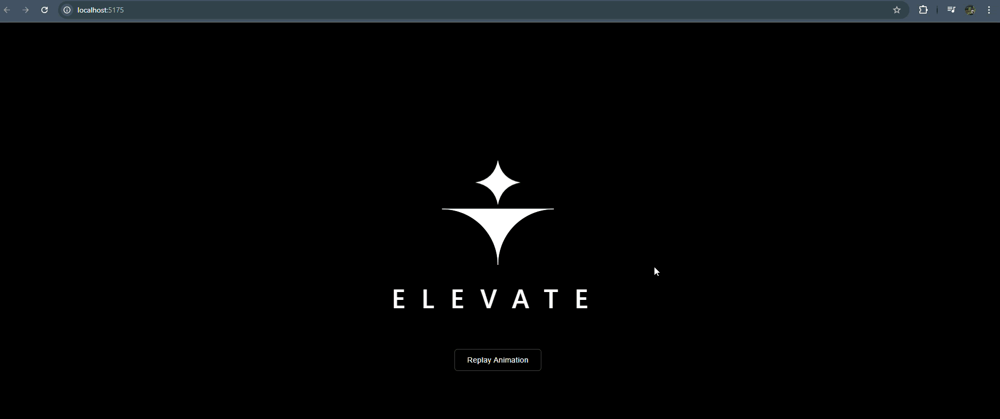

# Elevate Logo Animation

A React + TypeScript application featuring an animated "ELEVATE" logo with SVG graphics, including wing shapes and a 4-point star animation. The app includes a "Replay Animation" button to re-trigger the animation sequence.

## Demo



## Features

- Smooth SVG path animations using CSS keyframes
- 4-point star with rotation and scaling along an arc path
- Wing reveal effect with clip-path animation
- Horizontal line draws from center outward
- Curved wing edges animate from bottom to top
- Text fade-in with unified logo lift animation
- Replay button to re-trigger the full animation sequence

## Accessibility

- Supports `prefers-reduced-motion` for users who are sensitive to motion
- SVG includes `role="img"` and descriptive `aria-label` for screen readers
- Interactive button has clear `aria-label` for assistive technologies

## Prerequisites

Before running this application, make sure you have the following installed:

- **Node.js** (v18 or higher recommended)
- **npm** (comes with Node.js)

You can verify your installation by running:

```bash
node --version
npm --version
```

## Installation

1. Clone the repository:

```bash
git clone https://github.com/Mohak-Trivedi/growthx-fe-assignment.git
cd growthx-fe-assignment
```

2. Install dependencies:

```bash
npm install
```

## Running the Application

| Command           | Description                                      |
| ----------------- | ------------------------------------------------ |
| `npm run dev`     | Start development server (http://localhost:5173) |
| `npm run build`   | Build for production (outputs to `dist/`)        |
| `npm run preview` | Preview production build locally                 |

### Development

To start the development server with hot module replacement:

```bash
npm run dev
```

The application will be available at [http://localhost:5173](http://localhost:5173).

### Production Build

To create a production build:

```bash
npm run build
```

To preview the production build locally:

```bash
npm run preview
```

## Project Structure

```
├── src/
│   ├── components/
│   │   ├── ElevateLogo.tsx    # Main logo SVG component
│   │   └── ElevateLogo.css    # Animation styles
│   ├── App.tsx                # Main app with replay button
│   ├── App.css                # App styles
│   ├── main.tsx               # Entry point
│   ├── index.css              # Global styles
│   └── vite-env.d.ts          # Vite type definitions
├── index.html                 # HTML template
├── vite.config.ts             # Vite configuration
├── tsconfig.json              # TypeScript configuration
├── tsconfig.node.json         # TypeScript config for Node
└── package.json               # Project dependencies and scripts
```

## Tech Stack

- **React** 18
- **TypeScript** 5
- **Vite** 5
